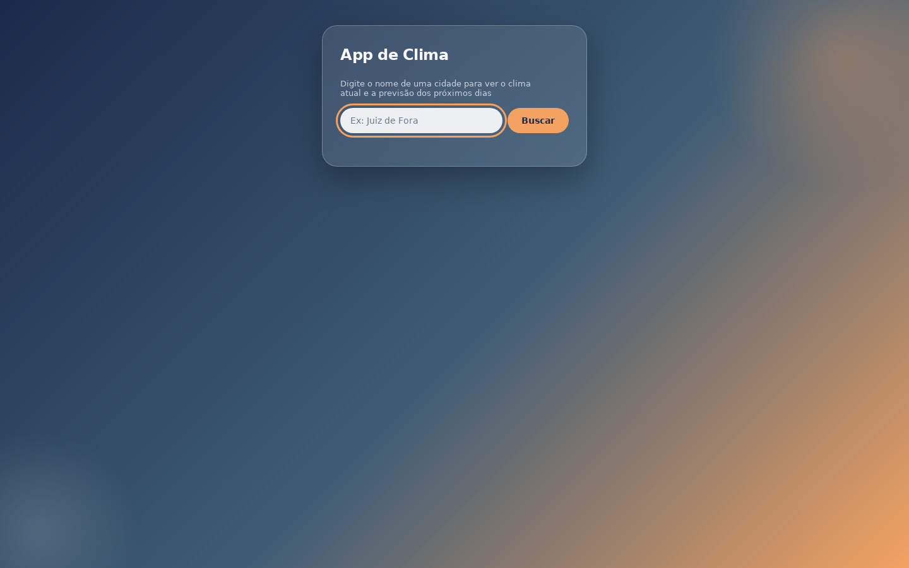
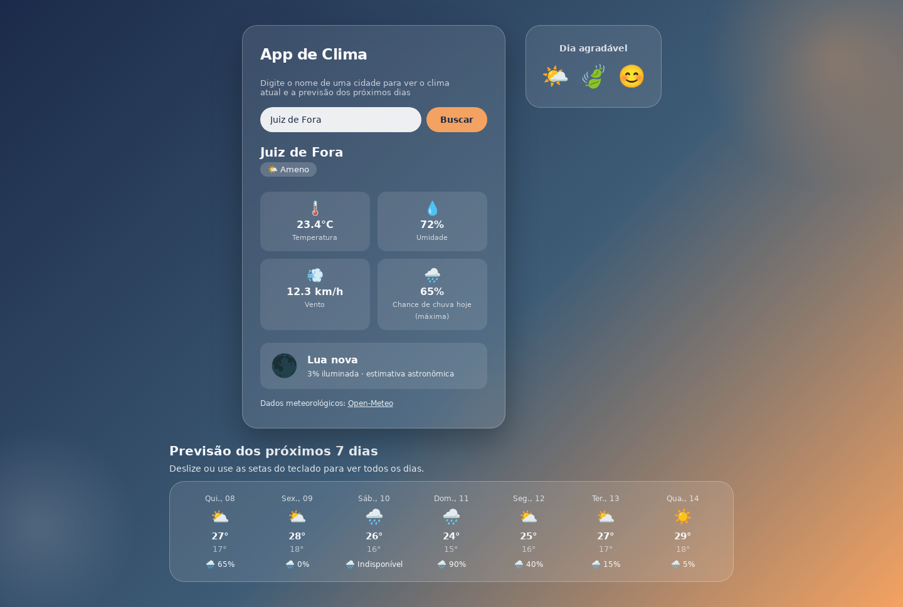
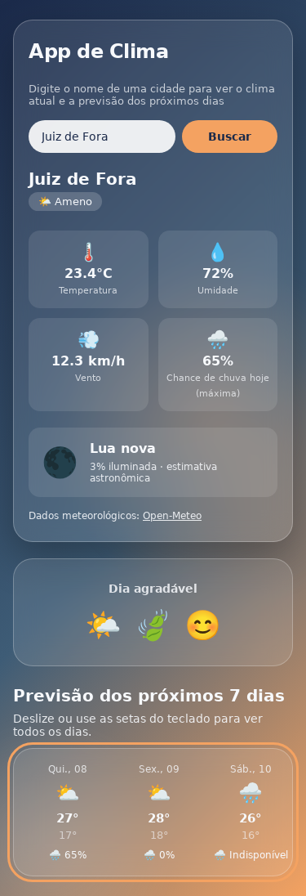

# 🌤️ App de Clima

Previsão do tempo por cidade, com clima atual, previsão de sete dias, chance de chuva e fase da Lua. Desenvolvido por **Josilene S. R. Coutinho** com React e Open-Meteo.

[Ver o site publicado](https://silecout.github.io/app-clima-react/)

## Sumário

- [Funcionalidades](#funcionalidades)
- [Telas](#telas)
- [Tecnologias e versões](#tecnologias-e-versões)
- [Como executar](#como-executar)
- [Organização](#organização)
- [Dados e fontes](#dados-e-fontes)
- [Validação](#validação)
- [Autora](#autora)

## Funcionalidades

- Busca por nome da cidade, com estados de carregamento e erro.
- Temperatura atual, umidade e vento.
- Chance de chuva hoje e nos sete dias da previsão. O percentual é a **probabilidade máxima de precipitação no dia**, não a quantidade de chuva nem uma previsão exclusiva para o instante atual.
- Fase lunar e percentual de iluminação estimados para o instante atual; atualização a cada minuto.
- Painel temático conforme a condição do tempo.
- Layout responsivo: rolagem vertical natural da página e horizontal apenas na faixa de previsão.
- Busca com rótulo acessível, erros anunciados e previsão navegável pelo teclado.

## Telas

Capturas de demonstração com respostas meteorológicas simuladas para Juiz de Fora; os valores não representam uma consulta ao vivo. A Lua é calculada no momento da captura.

### Tela inicial



### Resultado em desktop



### Resultado no celular



## Tecnologias e versões

Versões instaladas em `package-lock.json` (o intervalo aceito está em `package.json`).

| Biblioteca | Versão instalada |
| --- | --- |
| `react` | 19.2.7 |
| `react-dom` | 19.2.7 |
| `suncalc` | 2.1.1 |
| `@eslint/js` | 10.0.1 |
| `@types/react` | 19.2.17 |
| `@types/react-dom` | 19.2.3 |
| `@vitejs/plugin-react` | 6.0.3 |
| `eslint` | 10.6.0 |
| `eslint-plugin-react-hooks` | 7.1.1 |
| `eslint-plugin-react-refresh` | 0.5.3 |
| `globals` | 17.7.0 |
| `vite` | 8.1.3 |

JavaScript, HTML e CSS puro. Ambiente usado na validação: Node.js 24.19.0 e npm 11.9.0. Não é necessária chave de API.

## Como executar

```bash
git clone https://github.com/SileCout/app-clima-react.git
cd app-clima-react
npm ci
npm run dev
```

Abra o endereço mostrado pelo Vite, normalmente `http://localhost:5173/app-clima-react/`.

```bash
npm run lint
npm run build
npm run preview
```

O build fica em `dist/`. A base `/app-clima-react/` está configurada para o caminho do GitHub Pages. Para hospedar na raiz de outro domínio, ajuste `base` em `vite.config.js`. A publicação deve usar o conteúdo compilado de `dist`, não os arquivos de `src`.

## Organização

| Caminho | Responsabilidade |
| --- | --- |
| `src/App.jsx` | Busca geográfica e previsão, estados e composição da tela |
| `src/components/FormularioBusca.jsx` | Entrada da cidade |
| `src/components/ResultadoClima.jsx` | Clima atual e chance de chuva de hoje |
| `src/components/PrevisaoSemana.jsx` | Previsão dos sete dias |
| `src/components/FaseLua.jsx` | Fase lunar e atualização periódica |
| `src/components/PainelTematico.jsx` | Painel de emojis conforme clima |
| `src/utils/clima.js` | Ícones e categorias meteorológicas |
| `src/utils/chuva.js` | Formatação da chance de chuva, incluindo dados ausentes |
| `src/utils/lua.js` | Cálculo da fase e iluminação com SunCalc |
| `.github/screenshots/` | Capturas usadas nesta documentação |
| `.github/QA.md` | Relatório de QA e limitações da validação |

## Dados e fontes

- [Open-Meteo](https://open-meteo.com/en/docs): busca geográfica e previsão. A busca seleciona o primeiro resultado; nomes de cidades iguais podem ser ambíguos. Datas diárias usam `timezone=auto`, conforme a cidade.
- Chuva: `daily.precipitation_probability_max`, já em porcentagem. Ausência de dado aparece como **Indisponível**, preservando o valor **0%** quando retornado.
- [SunCalc](https://github.com/mourner/suncalc): cálculo astronômico local da fase e fração iluminada. O nome corresponde ao oitavo de ciclo mais próximo. É uma estimativa contínua, não um calendário de instantes exatos das fases principais. Os emojis são ilustrativos e não representam a orientação da Lua no céu de cada cidade.
- O acesso à previsão depende de internet e disponibilidade da Open-Meteo; a fase lunar não requer outra chamada de API.

## Validação

Veja o [relatório de QA](.github/QA.md), com a análise das barras de rolagem e os cenários executados.

## Autora

Josilene S. R. Coutinho — estudante de Análise e Desenvolvimento de Sistemas, em transição da saúde para tecnologia.

[GitHub](https://github.com/SileCout) · [LinkedIn](https://www.linkedin.com/in/josilene-sobreira-r-coutinho-578218310/)
